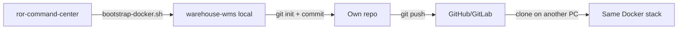
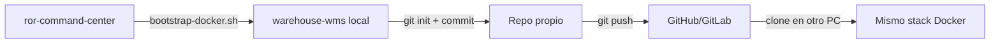

> Language: English | [Español](#versión-en-español)

# From Docker scaffold to your own repository

The app **must not live inside** `ror-command-center`. The bootstrap creates a sibling directory (default `../warehouse-wms`) that is already your independent project.

---

## Recommended flow



---

## Step 1 — Generate the app (Docker only)

From the framework repo:

```bash
cd examples/warehouse-wms
chmod +x bin/bootstrap-docker.sh bin/rails-new-docker.sh
./bin/bootstrap-docker.sh
# or a custom path:
# ./bin/bootstrap-docker.sh ~/projects/warehouse-wms
```

This creates `warehouse-wms/` with:

| Contents | Source |
|----------|--------|
| Rails 8 app + MySQL | `rails new` in a container |
| `docker-compose.yml`, `Dockerfile.dev` | scaffold |
| Phase 0 migrations | `examples/warehouse-wms/db/migrate/` |
| `StockUpdater` stub | `app/services/warehouse/` |
| Spec, ADRs, stories, runbook | copied from the framework `docs/` |
| `.ai/` | optional copy for Cursor agents |

---

## Step 2 — Database and server

```bash
cd ../warehouse-wms   # or your path

docker compose run --rm web rails db:create db:migrate
docker compose up
```

Common commands **without local Rails**:

```bash
docker compose run --rm web bundle exec rspec
docker compose run --rm web rails console
docker compose run --rm web rails generate model ...
docker compose exec web bash
```

---

## Step 3 — Create your own remote repository

The bootstrap already runs `git init` + initial commit.

### GitHub (gh CLI)

```bash
cd ~/projects/warehouse-wms
gh repo create warehouse-wms --private --source=. --remote=origin --push
```

### Without gh CLI

```bash
git remote add origin git@github.com:YOUR_ORG/warehouse-wms.git
git push -u origin main
```

From here on you **work only in `warehouse-wms`**. The framework repo remains a reference for agents/skills, not a mandatory monorepo.

---

## Step 4 — On another team or machine

```bash
git clone git@github.com:YOUR_ORG/warehouse-wms.git
cd warehouse-wms
cp .env.example .env   # if .env does not exist
docker compose build
docker compose run --rm web bundle install
docker compose run --rm web rails db:create db:migrate
docker compose up
```

You don't need Ruby or Rails installed on the host.

---

## What to keep in sync with the framework

| In `warehouse-wms` | Update from framework? |
|--------------------|------------------------|
| `docs/specs`, `docs/architecture` | Only if the product changes; manual copy or submodule |
| `.ai/` agents/skills | Optional: submodule or periodic copy |
| Already-applied migrations | **Do not** replace; evolve them in the app repo |
| `StockUpdater` | Implement in the app; use the example only as an initial reference |

### Optional submodule (documentation only)

If you want specs always up to date without mixing code:

```bash
cd warehouse-wms
git submodule add git@github.com:Rohega/ror-command-center.git vendor/ai-studio
ln -s vendor/ai-studio/docs/specs docs/specs-framework  # optional
```

Most teams **copy docs once** and evolve them in the app repo.

---

## Implementation branches (in your repo)

Work in `warehouse-wms`, not in the framework:

```bash
git checkout -b feature/warehouse-auth-rbac
# ...
git push -u origin feature/warehouse-auth-rbac
```

Merge order: see `docs/runbooks/warehouse-mvp-phase-0-kickoff.md`.

---

## WSL + Docker Desktop

If `docker` doesn't work in WSL:

1. Install [Docker Desktop](https://www.docker.com/products/docker-desktop/)
2. Settings → Resources → WSL Integration → enable your distro
3. Restart the WSL terminal
4. Verify: `docker info`

---

## Troubleshooting

| Problem | Solution |
|---------|----------|
| Port 3307 in use | Change `MYSQL_PORT` in `.env` |
| `bundle install` slow | Normal the first time; uses the `bundle_cache` volume |
| Permissions on files created by Docker | `sudo chown -R $USER:$USER .` in WSL if needed |
| `rails new` fails due to network | Retry; gem install needs internet |
| Devise migration before `add_role` | Run `rails generate devise:install` and `devise User` before `db:migrate` |

### Devise order (after bootstrap)

```bash
docker compose run --rm web bash bin/setup-devise.sh
docker compose run --rm web rails db:create db:migrate
```

Don't use `add_role_to_users` separately: `role` goes inside the `devise_create_users` migration.

### Error: Failed to open the referenced table 'users' (stock_movements)

`stock_movements` has an FK to `users`, but the Devise migration has a timestamp later than the WMS ones. Solution:

```bash
# Rename devise so it runs first (before 00002)
mv db/migrate/*devise_create_users*.rb db/migrate/20260616100001_devise_create_users.rb

docker compose run --rm web rails db:migrate
```

Or run `bin/setup-devise.sh` again (it renames automatically).

### Error: Duplicate column name 'email' (add_devise_to_users)

You have **two** Devise migrations: `devise_create_users` (correct) and `add_devise_to_users` (extra). Don't reset everything:

```bash
rm db/migrate/*add_devise_to_users*.rb
docker compose run --rm web rails db:migrate:status   # everything should be "up"
```

Only reset from scratch if you want a clean DB:

```bash
docker compose down -v
docker compose run --rm web rails db:create db:migrate
```

The `20260616100001_add_role_to_users` migration runs **before** Devise. Solution:

```bash
rm db/migrate/*add_role_to_users*.rb
docker compose run --rm web bash bin/setup-devise.sh
docker compose run --rm web rails db:migrate
```

If you already generated Devise manually, just delete `add_role_to_users` and add this in `*devise_create_users*.rb` before `t.timestamps`:

```ruby
t.integer :role, null: false, default: 2
```

### Gemfile: duplicate mysql2

`rails new --database=mysql` already adds `mysql2`. If `bundle install` fails due to a duplicate, edit `Gemfile` and **remove the extra line** `gem "mysql2"` at the end (keep only the rails one: `gem "mysql2", "~> 0.5"`).

---

## Summary

1. **Now:** `./bin/bootstrap-docker.sh` → `warehouse-wms` folder with Docker.
2. **Later:** `git push` to your own repo → the team clones and runs `docker compose up`.
3. **Never** depend on Rails on the host; everything runs in the `web` container.

---

## Versión en español

# Pasar de scaffold Docker a repositorio propio

La app **no debe vivir dentro** de `ror-command-center`. El bootstrap crea un directorio hermano (por defecto `../warehouse-wms`) que ya es tu proyecto independiente.

---

## Flujo recomendado



---

## Paso 1 — Generar la app (solo Docker)

Desde el framework repo:

```bash
cd examples/warehouse-wms
chmod +x bin/bootstrap-docker.sh bin/rails-new-docker.sh
./bin/bootstrap-docker.sh
# o ruta custom:
# ./bin/bootstrap-docker.sh ~/projects/warehouse-wms
```

Esto crea `warehouse-wms/` con:

| Contenido | Origen |
|-----------|--------|
| App Rails 8 + MySQL | `rails new` en contenedor |
| `docker-compose.yml`, `Dockerfile.dev` | scaffold |
| Migraciones Fase 0 | `examples/warehouse-wms/db/migrate/` |
| `StockUpdater` stub | `app/services/warehouse/` |
| Spec, ADRs, stories, runbook | copia de `docs/` del framework |
| `.ai/` | copia opcional para agentes Cursor |

---

## Paso 2 — Base de datos y servidor

```bash
cd ../warehouse-wms   # o tu ruta

docker compose run --rm web rails db:create db:migrate
docker compose up
```

Comandos habituales **sin Rails local**:

```bash
docker compose run --rm web bundle exec rspec
docker compose run --rm web rails console
docker compose run --rm web rails generate model ...
docker compose exec web bash
```

---

## Paso 3 — Crear repositorio remoto propio

El bootstrap ya hace `git init` + commit inicial.

### GitHub (gh CLI)

```bash
cd ~/projects/warehouse-wms
gh repo create warehouse-wms --private --source=. --remote=origin --push
```

### Sin gh CLI

```bash
git remote add origin git@github.com:TU_ORG/warehouse-wms.git
git push -u origin main
```

A partir de aquí **trabajas solo en `warehouse-wms`**. El framework repo queda como referencia de agentes/skills, no como monorepo obligatorio.

---

## Paso 4 — En otro equipo o máquina

```bash
git clone git@github.com:TU_ORG/warehouse-wms.git
cd warehouse-wms
cp .env.example .env   # si no existe .env
docker compose build
docker compose run --rm web bundle install
docker compose run --rm web rails db:create db:migrate
docker compose up
```

No necesitas Ruby ni Rails instalados en el host.

---

## Qué mantener sincronizado con el framework

| En `warehouse-wms` | ¿Actualizar desde framework? |
|--------------------|------------------------------|
| `docs/specs`, `docs/architecture` | Solo si cambia el producto; copia manual o submodule |
| `.ai/` agents/skills | Opcional: submodule o copia periódica |
| Migraciones ya aplicadas | **No** reemplazar; evolucionar en el repo de la app |
| `StockUpdater` | Implementar en app; usar ejemplo solo como referencia inicial |

### Submodule opcional (solo documentación)

Si quieres specs siempre al día sin mezclar código:

```bash
cd warehouse-wms
git submodule add git@github.com:Rohega/ror-command-center.git vendor/ai-studio
ln -s vendor/ai-studio/docs/specs docs/specs-framework  # opcional
```

La mayoría de equipos **copian docs una vez** y evolucionan en el repo de la app.

---

## Ramas de implementación (en tu repo)

Trabaja en `warehouse-wms`, no en el framework:

```bash
git checkout -b feature/warehouse-auth-rbac
# ...
git push -u origin feature/warehouse-auth-rbac
```

Orden de merge: ver `docs/runbooks/warehouse-mvp-phase-0-kickoff.md`.

---

## WSL + Docker Desktop

Si `docker` no funciona en WSL:

1. Instala [Docker Desktop](https://www.docker.com/products/docker-desktop/)
2. Settings → Resources → WSL Integration → activa tu distro
3. Reinicia la terminal WSL
4. Verifica: `docker info`

---

## Troubleshooting

| Problema | Solución |
|----------|----------|
| Puerto 3307 ocupado | Cambia `MYSQL_PORT` en `.env` |
| `bundle install` lento | Normal la primera vez; usa volumen `bundle_cache` |
| Permisos archivos creados por Docker | `sudo chown -R $USER:$USER .` en WSL si hace falta |
| `rails new` falla por red | Reintenta; gem install necesita internet |
| Migración Devise antes de `add_role` | Ejecuta `rails generate devise:install` y `devise User` antes de `db:migrate` |

### Orden Devise (después del bootstrap)

```bash
docker compose run --rm web bash bin/setup-devise.sh
docker compose run --rm web rails db:create db:migrate
```

No uses `add_role_to_users` por separado: `role` va dentro de la migración `devise_create_users`.

### Error: Failed to open the referenced table 'users' (stock_movements)

`stock_movements` tiene FK a `users`, pero la migración Devise tiene timestamp posterior a las WMS. Solución:

```bash
# Renombrar devise para que corra primero (antes de 00002)
mv db/migrate/*devise_create_users*.rb db/migrate/20260616100001_devise_create_users.rb

docker compose run --rm web rails db:migrate
```

O vuelve a ejecutar `bin/setup-devise.sh` (ya renombra automáticamente).

### Error: Duplicate column name 'email' (add_devise_to_users)

Tienes **dos** migraciones Devise: `devise_create_users` (correcta) y `add_devise_to_users` (sobra). No reinicies todo:

```bash
rm db/migrate/*add_devise_to_users*.rb
docker compose run --rm web rails db:migrate:status   # todo debe estar "up"
```

Solo reinicia desde cero si quieres DB limpia:

```bash
docker compose down -v
docker compose run --rm web rails db:create db:migrate
```

La migración `20260616100001_add_role_to_users` corre **antes** que Devise. Solución:

```bash
rm db/migrate/*add_role_to_users*.rb
docker compose run --rm web bash bin/setup-devise.sh
docker compose run --rm web rails db:migrate
```

Si ya generaste Devise manualmente, basta con borrar `add_role_to_users` y añadir en `*devise_create_users*.rb` antes de `t.timestamps`:

```ruby
t.integer :role, null: false, default: 2
```

### Gemfile: mysql2 duplicado

`rails new --database=mysql` ya añade `mysql2`. Si `bundle install` falla por duplicado, edita `Gemfile` y **elimina la línea extra** `gem "mysql2"` al final (deja solo la de rails: `gem "mysql2", "~> 0.5"`).

---

## Resumen

1. **Ahora:** `./bin/bootstrap-docker.sh` → carpeta `warehouse-wms` con Docker.
2. **Después:** `git push` a tu repo propio → equipo clona y usa `docker compose up`.
3. **Nunca** dependas de Rails en el host; todo va en contenedor `web`.
